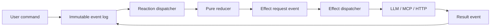

# agentlog

Минимальный event-sourced runtime для durable Python-агентов.

Agentlog — Python-фреймворк для создания durable AI-агентов в
FastAPI-приложениях. Append-only domain history — его reliability model:
она восстанавливает state и progression после restart и питает SSE/trace.

> История агента — immutable source of truth. State — чистая проекция истории.
> Внешний I/O выполняется только через durable effect boundary.

Статус: архитектурный прототип, не production framework.

## Главный сценарий

Проект строится ради одной вертикали:

```text
Chat UI
→ user command
→ immutable agent stream
→ LLM selects a tool
→ durable Python/MCP tool request
→ persisted tool result
→ next model step
→ final answer
→ reconnectable SSE
```

Реализованы и протестированы два entry point с разной длиной canonical stream
(не противоречие — два разных способа создать первый event):

```text
non-HTTP: UserMessageAdded → ... → RunCompleted        (9 events, version 0-8)
HTTP:     RunCreated → UserMessageAdded → ... → RunCompleted  (10 events, version 0-9)
```

Полная спецификация обоих сценариев, exact event lists и crash scenarios:
[reference chat agent](docs/reference-chat-agent.md).

## Durable model loop (0.2)

`DurableModelLoop(...).install(agent)` добавляет стандартную agent policy,
не создавая второго executor-а:

```text
domain event
→ ModelCallRequested
→ ModelCallSucceeded
→ optional ToolCallRequested / ToolCallSucceeded
→ ModelCallRequested
→ AnswerProduced / RunCompleted
```

Immutable tool definitions являются частью versioned definition; executable
`ModelProvider` и `ToolRegistry` передаются registration-specific через
`AgentlogApplication.register(..., resources=...)`. Полный контракт:
[durable model loop](docs/model-loop.md). Запускаемый FastAPI/Ollama пример:
[durable model-loop FastAPI example](examples/durable_model_loop_fastapi/README.md).
Формулы, reference interpreter и differential/property verification:
[executable model verification](docs/model-verification.md).

## Что это и чем не является

`agentlog` отвечает за:

- immutable event history;
- optimistic concurrency;
- replay состояния;
- pure synchronous reactions;
- at-least-once external effects;
- atomic result/checkpoint commits;
- durable subscription cursors.

Разделение ответственности:

```text
FastAPI     → HTTP commands, queries and SSE
FastMCP     → MCP tool server/client adapter
agentlog    → durable agent execution
SQLite      → local durable storage
```

Это не:

- универсальный workflow engine;
- LangGraph/Temporal replacement;
- собственная СУБД;
- exactly-once wrapper для произвольного внешнего API;
- готовая FastAPI или MCP интеграция.

Проект находится в существующей категории durable execution. Проверенное
позиционирование относительно Restate, DBOS, LangGraph и Temporal:
[docs/positioning.md](docs/positioning.md).

Ключевая гипотеза:

> Другие runtimes делают выполнение durable. `agentlog` должен сделать causal
> domain-event history публичной моделью продукта.

## Архитектура



### Immutable domain log

Каждый `Event` содержит plain immutable data:

```text
event_id
event_type
data
metadata
```

При сохранении добавляются:

```text
stream_id
stream_version
global_position
created_at
```

Events нельзя изменять задним числом.

### Mutable operational state

Checkpoints mutable — это нормально. Они не являются source of truth:

```text
immutable: events
mutable: checkpoints, leases, retries, caches, snapshots
```

Сейчас реализованы только checkpoints.

### Reducer

```text
state × event → state
```

У одного `AgentDefinition` ровно один reducer и явная `initial_state`.

Replay API разделяет два намерения:

```python
agent.rebuild(history)
agent.rebuild_through(history, through_version=12)
```

Полный replay не кодирует отсутствие границы через `Optional`.

### Reaction

```text
event × state → list[event]
```

Reaction синхронна, не должна делать I/O и только фиксирует новое domain
решение.

### Effect

```text
request event
→ external I/O
→ succeeded/failed event
```

Гарантия:

```text
at-least-once external execution
+
atomic result-event/checkpoint commit
```

Stable operation ID по умолчанию — `event_id` immutable request event.

Подробный контракт: [effect execution semantics](docs/effects.md).

## Быстрый запуск

Требуется Python 3.11+. Runtime не имеет внешних runtime dependencies.

Запуск тестов:

```bash
PYTHONWARNINGS=error \
PYTHONPATH=src \
python3 -m unittest discover -s tests -v
```

Текущее подтверждённое состояние:

```text
Ran 201 tests
OK
```

Запуск reference agent без API keys:

```bash
PYTHONPATH=src python3 examples/chat_mcp_agent/main.py
```

Пример использует SQLite, fake LLM и fake MCP и печатает canonical stream и
финальный state.

## Public API

Импортируемая поверхность разделена на два уровня. Оба стабильны и
поддерживаются — второй не "deprecated", он просто ниже уровнем.

```text
primary (declarative framework + FastAPI integration):
    agentlog.Agent
    agentlog.CommandRejected
    agentlog.EffectFailed
    agentlog.DefinitionMismatchError
    agentlog.TerminalEventConflictError
    agentlog.Event
    agentlog.EventStore
    agentlog.SQLiteEventStore
    agentlog.InMemoryEventStore
    agentlog.fastapi.AgentlogApplication

advanced (hand-assembled runtime, without the declarative Agent API --
          то, что показывает секция "Минимальный API" ниже):
    agentlog.AgentDefinition
    agentlog.DurableDispatcher
    agentlog.DurableEffectDispatcher
    agentlog.EffectRegistry
    agentlog.EffectContext
    agentlog.effect_request
    agentlog.TraceService
    agentlog.build_causal_trace
    agentlog.trace_to_json
```

`import agentlog` никогда не импортирует FastAPI (проверено тестом) —
`agentlog.fastapi` требует установленный `fastapi` extra и явный отдельный
импорт:

```python
from agentlog import Agent, SQLiteEventStore
from agentlog.fastapi import AgentlogApplication
```

`agentlog.demo` — CLI entry point для Flow Xray интеграции
(`python -m agentlog.demo`), не часть импортируемого API.

Всё, что начинается с `_` в любом модуле (`_commit_outputs_with_retry`,
`_normalize_effect_outputs`, `_subscription_name`, ...) — внутренняя
механика, может измениться без предупреждения в любой версии.

Один законченный reference app на этом API, с walkthrough create → command
→ kill → restart → trace: [`examples/support_agent/`](examples/support_agent/README.md).
Operational contract для `Agent(version=...)` и rolling deploy:
[docs/versioning.md](docs/versioning.md).

## Минимальный API

### Event store

```python
from agentlog import Event, SQLiteEventStore

store = await SQLiteEventStore.open("agent.db")

await store.append(
    stream_id="run-123",
    expected_version=-1,
    events=[
        Event(
            "UserMessageAdded",
            {"text": "Покажи давление A-17"},
        )
    ],
)

history = await store.load("run-123")
```

`expected_version=-1` означает, что stream ещё не существует. Blind append
отсутствует.

### Agent definition

```python
from dataclasses import dataclass, replace

from agentlog import AgentDefinition, Event, effect_request


@dataclass(frozen=True)
class State:
    messages: tuple[str, ...] = ()


agent = AgentDefinition(
    "assistant",
    initial_state=State,
    terminal_event_types={
        "RunCompleted",
        "RunFailed",
        "RunCancelled",
    },
)


@agent.reducer
def evolve(state: State, event: Event) -> State:
    if event.event_type == "UserMessageAdded":
        return replace(
            state,
            messages=state.messages + (str(event.data["text"]),),
        )
    return state


@agent.react("UserMessageAdded")
def request_model(event: Event, state: State) -> list[Event]:
    return [
        effect_request(
            "ModelCallRequested",
            {},
            {"causation_id": str(event.event_id)},
        )
    ]
```

### Effect handler

```python
from agentlog import EffectContext, EffectRegistry

effects = EffectRegistry[State]()


@effects.effect("ModelCallRequested")
async def call_model(
    event: Event,
    state: State,
    context: EffectContext,
) -> list[Event]:
    result = await context.require("llm").respond(
        messages=state.messages,
        operation_id=str(event.event_id),
    )
    return [
        Event(
            "ModelCallSucceeded",
            {"response": result},
        )
    ]
```

Полный executable вариант:
[examples/chat_mcp_agent/main.py](examples/chat_mcp_agent/main.py).

## Подтверждённые гарантии

Тестами вычислительно подтверждены:

- immutable JSON-compatible event payload;
- уникальные `event_id`;
- последовательные версии внутри stream;
- optimistic concurrency;
- atomic batch append;
- глобальный ordered event log;
- O(1)/single-query lookup текущей stream version;
- durable compare-and-set checkpoints;
- atomic reaction outputs + checkpoint;
- atomic effect results + checkpoint;
- rollback result при injected checkpoint failure;
- retry external effect с тем же operation ID;
- terminal domain failure через `*Failed` event;
- unknown tool/model output rejection без retry loop;
- отсутствие новых actions после terminal run event;
- сохранение committed history после `os._exit()`;
- application-level запрет `UPDATE`/`DELETE`;
- отсутствие resource warnings в тестируемых путях.

SQLite работает в WAL mode с `synchronous=FULL`. Гарантия ограничена
нормальным поведением ОС, файловой системы и hardware flush. Владелец файла
может заменить или удалить базу; tamper-evidence пока отсутствует.

## Не реализовано

- настоящий MCP adapter;
- OpenAI/Gemini/Anthropic adapters (Ollama adapter реализован);
- worker leases и multi-process single-flight;
- retry backoff и persisted attempts;
- human approval;
- schema upcasters;
- fork/re-execution;
- snapshots;
- KurrentDB/PostgreSQL adapters;
- production auth, backup и disaster recovery.

## HTTP adapter

```text
POST /agents/{agent_name}/runs
→ return run_id
→ GET /agents/{agent_name}/runs/{run_id}/stream
→ Last-Event-ID reconnect/replay
```

Публичный endpoint должен принимать command:

```http
POST /agents/{agent_name}/runs
```

Он не должен разрешать клиенту добавлять произвольные domain events.

SSE читает event log после `Last-Event-ID`, а не использует отдельный in-memory
streaming bus. Для endpoint одного run SSE `id` равен его непрерывному
`stream_version`; `global_position` остаётся внутренним cursor глобальных
subscriptions и projections.

`create_app()` — standalone convenience, не единственная модель владения.
Agentlog — embeddable runtime: для монтирования в уже существующее
приложение (свой lifespan, свои routes) используй `agentlog.fastapi.Agentlog`
напрямую:

```python
from fastapi import FastAPI
from agentlog.fastapi import Agentlog

agentlog = Agentlog(store=store, runtimes={"energy-assistant": runtime})
app = FastAPI(lifespan=agentlog.lifespan)
app.include_router(agentlog.router, prefix="/api")
```

FastAPI остаётся optional dependency: `import agentlog` работает без него;
`from agentlog.fastapi import Agentlog` даёт понятную ошибку, если extra не
установлен.

Lifecycle explicit и production-safe для single-process MVP: мёртвый
background dispatcher переходит в `status="unhealthy"` (`agentlog.health`,
`agentlog.is_healthy`, `GET /agents/_health` → 503) прежде, чем это стало
бы видно только через `stop()`; `stop()` ограничен
`shutdown_timeout_seconds` (default 10s) — при таймауте worker
принудительно cancel'ится и awaits, поэтому shutdown не виснет навсегда.
Retry/supervision и multi-process worker coordination сознательно не
реализованы в этом MVP. Полный контракт (constructor, health states,
worker failure semantics, bounded shutdown, cancellation limitation,
lifespan composition, prefix behavior): [docs/fastapi.md](docs/fastapi.md).

Runnable examples:
[examples/http_chat_agent/main.py](examples/http_chat_agent/main.py) (standalone),
[examples/embedded_fastapi/main.py](examples/embedded_fastapi/main.py) (embedded,
host app owns `/health` + its own lifespan).

## Causal trace export

`TraceService.export(agent_name, run_id)` строит `CausalTrace` одного run как
чистую проекцию immutable log, без второго trace viewer внутри Agentlog.
Опционально: `GET /agents/{agent_name}/runs/{run_id}/trace`.

Wire contract (`schema_version=1`, `graph_kind=domain-event-history`):
`agent_name`, `run_id`, `terminal_status`, `latest_stream_version`, `roots`,
`nodes` (`event_id`, `event_type`, `stream_id`, `stream_version`,
`global_position`, `correlation_id`, `causation_id`, `operation_id`, `data`,
`metadata`, `created_at`), `edges` (`source_event_id`, `target_event_id`,
`kind: "caused"`), `timeline` (`event_id`, `stream_version`,
`global_position`), `dangling_causation`.

**Completed Agentlog runs уже рендерятся через Flow Xray этим JSON** — не
только направление, а подтверждённое текущее состояние. Effect request/result
events хранят один explicit `operation_id` (at-least-once execution — не
exactly-once); durable dispatchers namespace-isolated через canonical
`{agent_name}:{run_id}` stream ID. Полный контракт и границы ответственности:
[docs/flow-xray.md](docs/flow-xray.md).

### Demo command for Flow Xray

Стабильный subprocess boundary, вызываемый Flow Xray, работает из
установленного пакета без `PYTHONPATH` и без запуска из этого репозитория:

```bash
python -m agentlog.demo --status completed --output trace.json
python -m agentlog.demo --status active    --output trace.json
```

Эта команда генерирует только Agentlog JSON (`schema_version=1`,
`graph_kind=domain-event-history`) через реальный exporter
(`TraceService`/`trace_to_json`) — fake LLM/MCP adapters, без сети, без
Flow Xray dependency. Рендеринг в HTML и совмещённая one-command demo —
ответственность Flow Xray, не этой команды.

## Репозиторий

```text
src/agentlog/
├── core.py
├── http.py
├── sqlite.py
├── streams.py
├── runtime.py
├── trace.py
└── __init__.py

examples/chat_mcp_agent/
└── main.py

examples/http_chat_agent/
└── main.py

docs/
├── effects.md
├── flow-xray.md
├── positioning.md
└── reference-chat-agent.md

tests/
├── test_agent_isolation.py
├── test_core.py
├── test_effect_metadata.py
├── test_http.py
├── test_runtime.py
├── test_sqlite.py
├── test_trace.py
├── test_trace_http_contract.py
└── test_trace_wire.py
```

## Работа нескольких агентов

Перед изменением:

1. прочитать README и релевантный документ из `docs/`;
2. выбрать один независимый slice;
3. перечислить touched files и инварианты;
4. не менять общий public contract без координации;
5. добавить исполняемый acceptance test;
6. обновить документацию при изменении гарантии.

Без координации нельзя параллельно менять:

- `EventStore`;
- SQLite schema;
- atomic subscription transaction;
- reducer/reaction signatures;
- effect failure semantics;
- checkpoint semantics.

Главный review-инвариант:

> Гарантия существует только после исполняемого теста.
